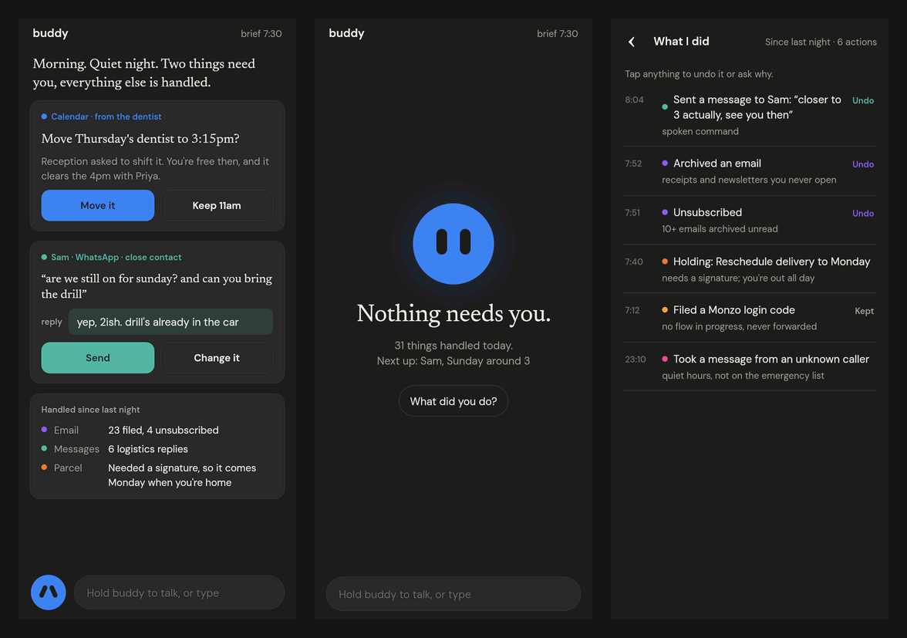
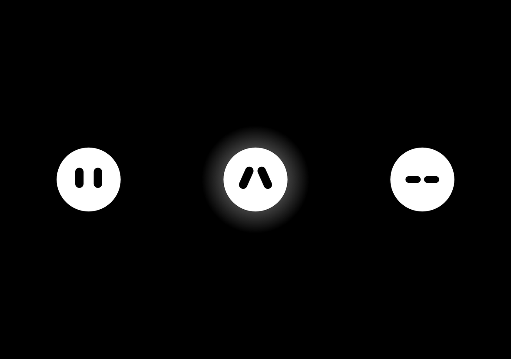
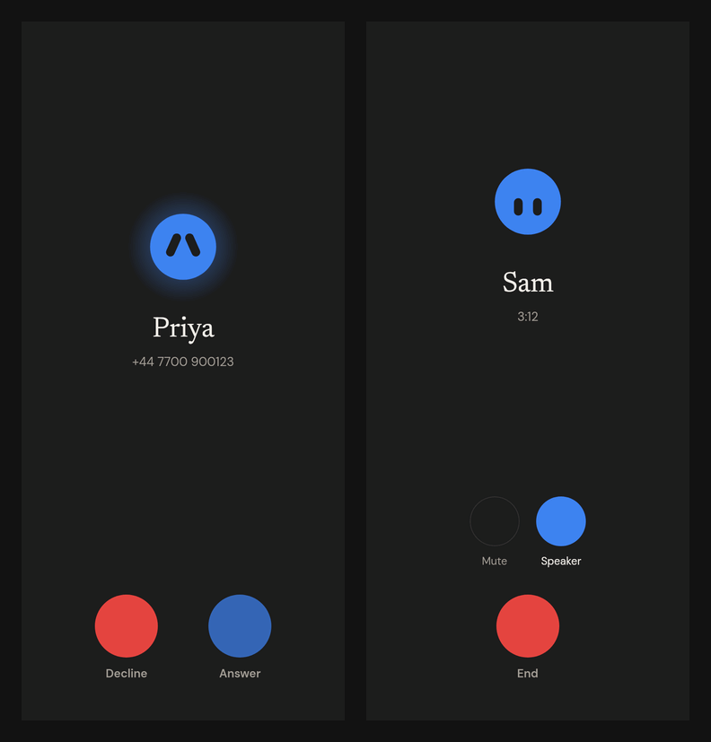
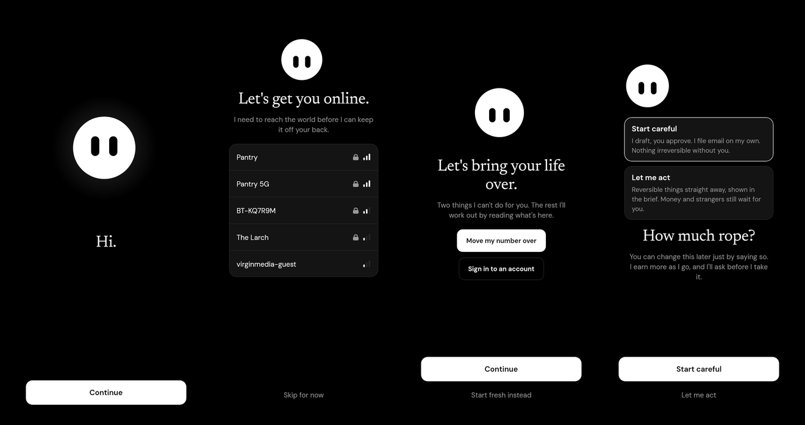
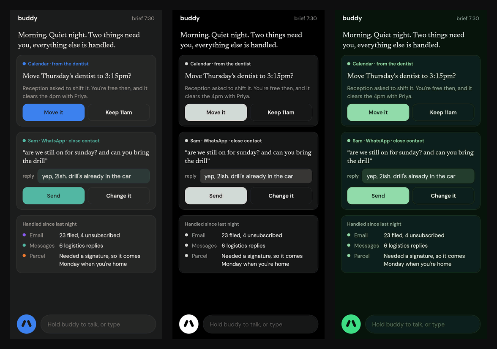

# buddy

**The phone you never have to look at.**

buddy is an agent-first version of Android. Instead of a grid of apps that each demand
attention, the phone runs a single always-on agent that reads everything the apps
produce, holds the full context of your life, and acts on your behalf. Email, messages,
calendar, deliveries, bills, bookings, social: handled in the background. You hear from
the phone only when it needs a decision from you, and it tries to make that rare.

## What it looks like

Nothing below is a mockup. `core/android-shots` draws the real screens from the app's own
source on a host, so these are the screens the phone draws, rendered by the same code.

<table>
<tr>
<td width="50%" align="center"></td>
<td width="50%" align="center"></td>
</tr>
<tr>
<td align="center"><b>The first run.</b> The whole screen is him. Two eyes open, the ground comes in from the outside, and what is left is a creature in the middle of the phone.</td>
<td align="center"><b>Power-on.</b> The boot animation is drawn from the same geometry as the face, and ends on the frame the lock screen starts with.</td>
</tr>
</table>

### The home is a conversation, not a grid



Left: the morning brief — a calendar decision and a reply to a close contact, each one tap
to resolve, and a count of what was handled without you. Middle: the usual state, which is
nothing needing you. Right: everything buddy did, with an undo on each line.

### A locked phone says one thing



Whether anything needs you, and that is all: no clock, no notification list, no shortcuts.
At rest he breathes and blinks; when something is waiting the eyes lift and the glow warms;
during quiet hours they are shut. No count, no preview, no sender — the eyes lifting is the
notification.

### The phone is still a phone



buddy holds the dialer role and there is no phone app in the image, so this is the only
call screen on the device. People who matter arrive by name, from the entity graph;
everyone else arrives honestly as a number.

### Moving in



There is no setup wizard: buddy is it. He gets the phone online, takes the first PIN that
the ledger's key is bound to, and hands you the two things no app can do for anyone —
carrying your number over and signing in. Everything else about you he works out by
reading what is already on the phone.

### Three schemes



One colour per domain, so a blue card is always calendar and amber is always money.

<details>
<summary>Rendering these yourself</summary>

```
./gradlew -Pshots :core:android-shots:run --args="shots --frames"
```

Writes every screen as a PNG, and with `--frames` the wake-up as a timestamped frame
sequence. It renders the wake in real time, because the sequence uses delays as well as
the frame clock, so that run takes about as long as the animation does.

</details>

The plan lives in `docs/`; Phase 0 code is under way. Read the plan in order:

| Doc | What it covers |
|---|---|
| [docs/00-vision.md](docs/00-vision.md) | What "agent-first" means, the principles, and what success looks like |
| [docs/01-architecture.md](docs/01-architecture.md) | System layers, the Android integration strategy, model strategy, tech stack |
| [docs/02-context-and-memory.md](docs/02-context-and-memory.md) | The life ledger: how the agent gets context from every app and remembers it |
| [docs/03-autonomy-and-trust.md](docs/03-autonomy-and-trust.md) | Autonomy tiers, action gating, undo, prompt injection, security and privacy |
| [docs/04-domain-playbooks.md](docs/04-domain-playbooks.md) | Per-domain behaviour: email, messaging, calendar, money, travel, calls, and more |
| [docs/05-roadmap.md](docs/05-roadmap.md) | Phased build plan with milestones, metrics, and repo layout |
| [docs/06-open-questions.md](docs/06-open-questions.md) | Decisions made, what is still open, and known risks |
| [docs/07-holistic-agent.md](docs/07-holistic-agent.md) | The continuous agent: tasks, mandates, wakes, compiled memory, reach; what Instinct got right and wrong |
| [docs/phase-0.md](docs/phase-0.md) | Phase 0 status: what exists, what is verified, what needs the build host or the phone |
| [docs/phase-1.md](docs/phase-1.md) | Phase 1 status: triage, entities, the brief, the audio gate, the eval harness |
| [docs/phase-2.md](docs/phase-2.md) | Phase 2 status: policy engine, actuation, connectors, the act loop, style, memory |
| [docs/phase-3.md](docs/phase-3.md) | Phase 3 status: app automation, money, logistics, voice, the vision fallback |
| [docs/phase-4.md](docs/phase-4.md) | Phase 4 status: hardening, the watch, bystander controls, onboarding |
| [docs/phase-5.md](docs/phase-5.md) | Phase 5 status: the gate report and the second user |
| [docs/security-review.md](docs/security-review.md) | The review checklist a second person works through before Phase 4 ships |
| [docs/second-user.md](docs/second-user.md) | The procedure for adding a second user |

## Repository layout

| Path | What |
|---|---|
| `core/ledger` | The life ledger: schema, append-only rules, ids, search. JVM, tested. |
| `core/perception` | Normalisers from platform snapshots to ledger events. JVM, tested. |
| `core/triage` | The five-way triage decision and structured field extraction. JVM, tested. |
| `core/entities` | People across apps, threads, recurring charges. JVM, tested. |
| `core/cognition` | Context slices, untrusted envelopes, the Claude client, the agent's wake loop and tool surface, the brief planner, memory. JVM, tested. |
| `core/audio` | When transcription may run: off-limits rules, daily budget, participant rule. JVM, tested. |
| `core/tasks` | The unit of work that survives a wake and a restart: tasks as ledger events, mandates, signals, the waker. JVM, tested. |
| `core/policy` | The security boundary: action classification, autonomy levels, hard limits in code, the trust ladder, onboarding. JVM, tested. |
| `core/actuation` | Actions, connectors, the executor with holds and undo, the email connector. JVM, tested. |
| `core/style` | How the user writes to each relationship class; a gate on drafts. JVM, tested. |
| `core/automation` | App recipes over captured screens with drift detection. JVM, tested. |
| `core/money`, `core/logistics`, `core/voice`, `core/profile` | Domain logic: money, deliveries and travel, voice commands, profile bootstrap. JVM, tested. |
| `eval/replay` | Replay a ledger through triage and score it against labels. |
| `eval/injection` | The injection corpus and the proof that policy stops every case. |
| `eval/mandate` | The mandate corpus: jobs that try to exceed the authority they were given, and the proof that none of them runs. |
| `eval/metrics` | The success metrics and the gate report from a ledger. |
| `wear/` | The Pixel Watch app. Built with the Android SDK on the host. |
| `core/android` | The buddy system app, including the surface (the chat, the creature, onboarding). Built by Soong inside the GrapheneOS tree. |
| `core/android-verify` | Compiles the system app on the host against the full framework jar and the Compose API, and runs its JVM-testable parts, so CI catches errors in it without the platform tree. |
| `core/android-shots` | Draws the app's screens on the host from the same sources, which is where the images above come from. Opt-in with `-Pshots`. |
| `platform/` | Product config, overlays, permissions, SELinux, patch specs, build scripts. |
| `Android.bp` | Soong modules for the app and its config, read when this repo is `vendor/buddy`. |

The surface's design lives on a canvas: https://claude.ai/code/artifact/83f7ec6f-8991-48c1-916f-22a7bd5f91ed

Run the JVM tests, and the compile check for the system app, anywhere with a JDK 17 or newer:

```
./gradlew build
```

## The one-paragraph version

buddy is an Android build, not an app. Two requirements decide that: always-on audio
and content capture across every app, both of which are framework capabilities that no
app can be granted. So Phase 0 is a fork of the GrapheneOS source tree for the Pixel 10 Pro XL, with our own keys,
with buddy's subsystems running as system services in separate SELinux domains. The
perception layer reads every app through content capture, notifications, and APIs. A
tiered audio pipeline listens on the DSP for free, transcribes on the NPU only when the
user is in a conversation that matters, and never stores raw audio. Everything lands in
an encrypted on-device ledger. A small on-device model triages the firehose; a frontier
model in the cloud plans and acts only on the slice of context each task needs, and
every action it proposes passes a policy engine it cannot bypass. The phone's default
state is screen-off in a pocket, with Pixel Buds as the primary surface.
